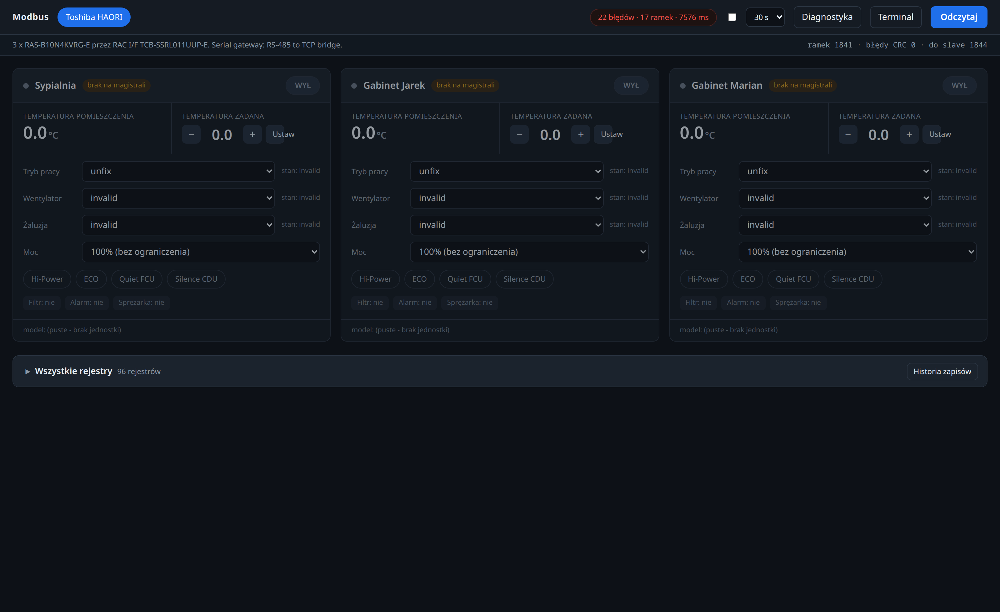
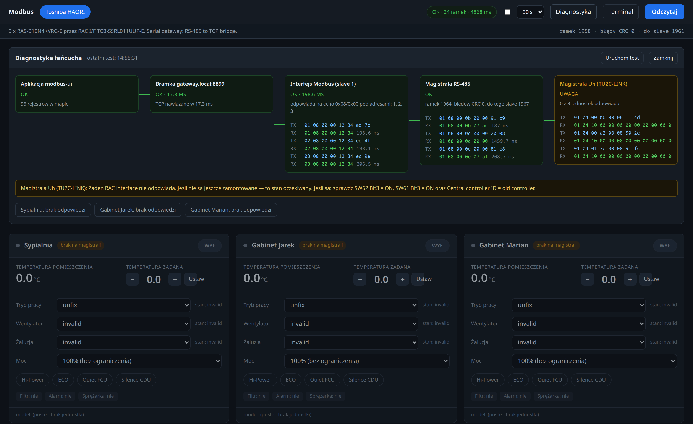
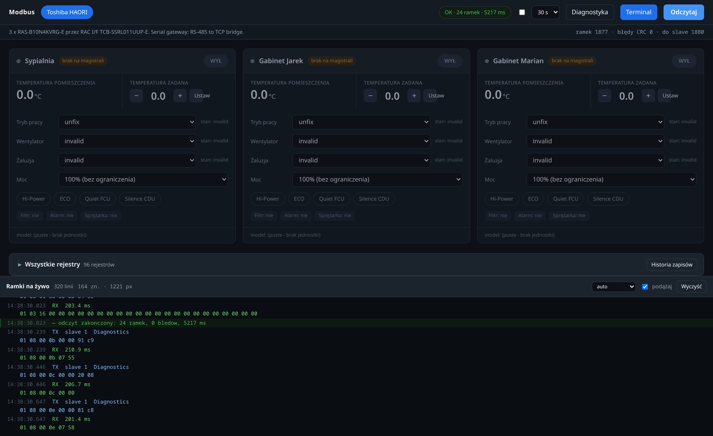
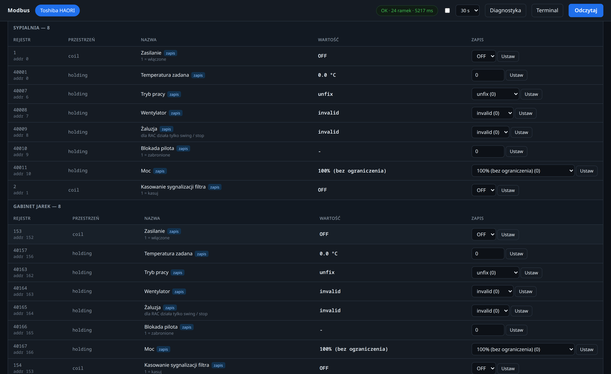
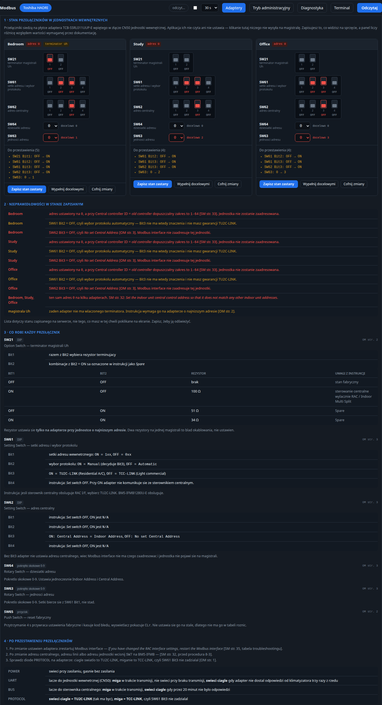

# modbus-ui

A small, dependency-free web UI for browsing and writing **Modbus** registers,
built for hardware that is normally only reachable through a vendor cloud.

It was written to take three Toshiba HAORI air conditioners off the manufacturer's
cloud and drive them locally over Modbus RTU, but the register map is pluggable —
any device with a documented map can be added.



## Why

Vendor apps hide the interesting parts. A Modbus interface exposes them, but a raw
register dump is unreadable: hundreds of numbered addresses with no grouping, no
units, and no indication of what is safe to write. This tool sits in between:

- **per-device cards** with the state you actually care about, and controls that write back
- **the full register table** underneath, grouped by category, collapsed by default
- **a chain diagnostic** that tells you *where* the link is broken, not just that it is
- **a live frame terminal** showing every TX/RX in hex with round-trip timing

## Screenshots

### Chain diagnostics
Five nodes from the application down to the field bus, streamed over SSE so each tile
updates as its stage runs — pending, running, then the result. Every tile carries the
frames it actually put on the wire, TX and RX in hex with round-trip timing. A failing
node explains what to check, including device-specific hints such as DIP switch positions.



### Live frame terminal
Every Modbus transaction as it happens. The dock sits on the right while the longest
line still fits; when it does not, it moves to a full-width strip at the bottom so
lines are never wrapped.



### Register table
All registers, grouped by category and by unit, with documentation numbers and wire
addresses side by side.



### Hardware switch planner

Some devices only reach the bus once physical DIP switches and rotary selectors are set
correctly on an adapter board, and no protocol can read those back. This view holds the
state a human found on the board, computes the required state from the addresses in the
config, and lists the exact moves between the two. Every rule is quoted from the vendor
manual with a page reference; nothing here talks to the bus.



## Design notes

**No dependencies.** Python standard library only — `http.server`, `socket`, `struct`.
The Modbus client, the CRC, the HTTP layer and the frontend are all hand-rolled.
This runs on a 512 MB container with nothing installed beyond `python3`.

**Two framings.** `rtuovertcp` for transparent serial bridges, `tcp` (MBAP) for
gateways doing Modbus TCP ⇄ RTU conversion. Chosen per device in the config.

**Batched reads.** Registers are merged into contiguous spans before hitting the wire,
so 96 registers cost 24 frames instead of 96. Span limits stay under the 249-octet
request cap that some interfaces enforce.

**Guarded writes.** Writes are refused unless the register is explicitly marked
`writable` in the map; `input` and `discrete` spaces are read-only by definition.
Enum values and numeric bounds are validated server-side. Before anything is sent the
UI shows a confirmation dialog with the **exact frame in hex**, and every write is
appended to an audit log.

**Physical state is data, not guesswork.** The adapter switch view never claims to read
hardware it cannot read. It stores what a human reported, derives the target from the
configured addresses by rules, and reports the difference. Validation (address range,
duplicate addresses, more than one bus terminator, switch combinations the manual marks
`N/A`) is computed server-side from those rules, with a manual page cited on every finding.

**Non-invasive diagnostics.** Reachability is proven with function `0x08` sub `0x00`
(loopback) and the `0x08` error counters, which are answered by the Modbus interface
itself and never touch the field bus or the appliances.

## Layout

```
app/
  modbus.py            Modbus client, CRC, transaction ring buffer
  server.py            HTTP + JSON API, read batching, write validation, chain trace
  devices/toshiba.py   register map (generated per indoor unit)
  devices/racif.py     adapter board switches: spec, target values, validation rules
  static/              frontend — no framework, no build step
deploy/
  config.example.json  device definitions
  modbus-ui.service    systemd unit (hardened: ProtectSystem=strict, dedicated user)
  deploy.sh            ship app/ to the target container and restart
```

## API

| Endpoint | Purpose |
|---|---|
| `GET /api/devices` | device and register definitions |
| `GET /api/read?device=ID` | read every register; returns frame count and elapsed time |
| `GET /api/diag?device=ID` | `0x08` counters: bus messages, CRC errors, messages to slave |
| `GET /api/trace?device=ID` | chain diagnostic, node by node |
| `GET /api/log?since=N` | transaction ring buffer (600 entries) — feeds the terminal |
| `POST /api/preview` | validate a write and return the frame **without sending it** |
| `POST /api/write` | perform the write (whitelist + audit) |
| `GET /api/modules?device=ID` | adapter switch spec, target values, recorded state, diff |
| `POST /api/modules` | record the switch state found on one adapter board |
| `GET /api/audit` | last 100 writes |

## Install

```bash
# on the target host
useradd -r -s /usr/sbin/nologin -d /opt/modbus-ui modbus
mkdir -p /opt/modbus-ui /etc/modbus-ui /var/lib/modbus-ui
cp -r app /opt/modbus-ui/
cp deploy/config.example.json /etc/modbus-ui/config.json   # then edit it
cp deploy/modbus-ui.service /etc/systemd/system/
chown -R modbus:modbus /opt/modbus-ui /var/lib/modbus-ui
systemctl enable --now modbus-ui
```

Listens on `:8080`. Put a reverse proxy in front of it for TLS.

## Adding a device

1. Write a module in `app/devices/` exposing `build(...) -> list[dict]`.
2. Register it in `load_config()` in `server.py`.
3. Add an entry to `config.json` with `host`, `port`, `framing`, `slave`, `map`.

Register descriptor fields:

| Field | Meaning |
|---|---|
| `key`, `group`, `name` | identity and grouping |
| `space` | `coil` / `discrete` / `input` / `holding` |
| `number`, `addr` | documentation number and wire address |
| `count`, `type` | `uint16`, `int16`, `bool`, `bits`, `string`, `hex16` |
| `scale`, `unit` | numeric scaling and display unit |
| `enum`, `bits` | value labels / bitfield labels |
| `writable`, `wmin`, `wmax`, `wstep` | write permission and bounds |
| `cat` | `control` / `state` / `special` / `ident` / `diag` |
| `card`, `card_order`, `status_key` | placement on the device card |

Do **not** use `unit` for anything other than the unit of measurement — see `CLAUDE.md`.

## Status

Working against a Toshiba `BMS-IFMB1280U-E` Modbus interface: reads all 96 registers
in 24 frames with zero CRC errors. The `TCB-SSRL011UUP-E` RAC interfaces that connect
the indoor units to the field bus are not installed yet, so the units correctly report
as absent.

## License

MIT — see `LICENSE`.
